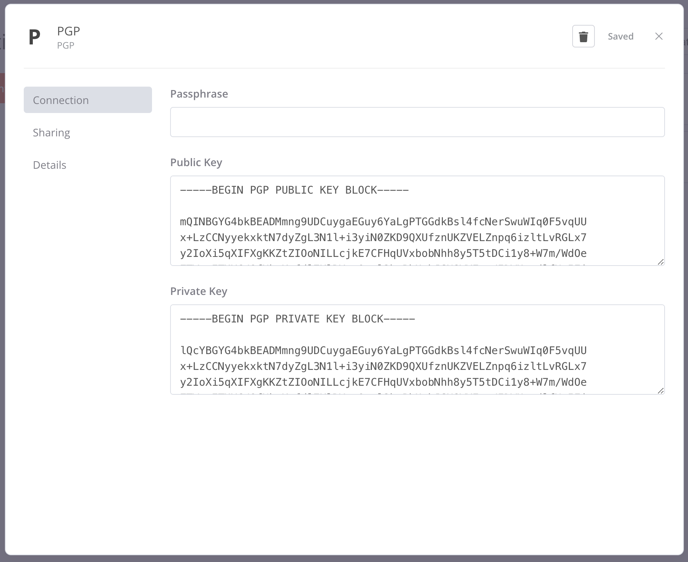
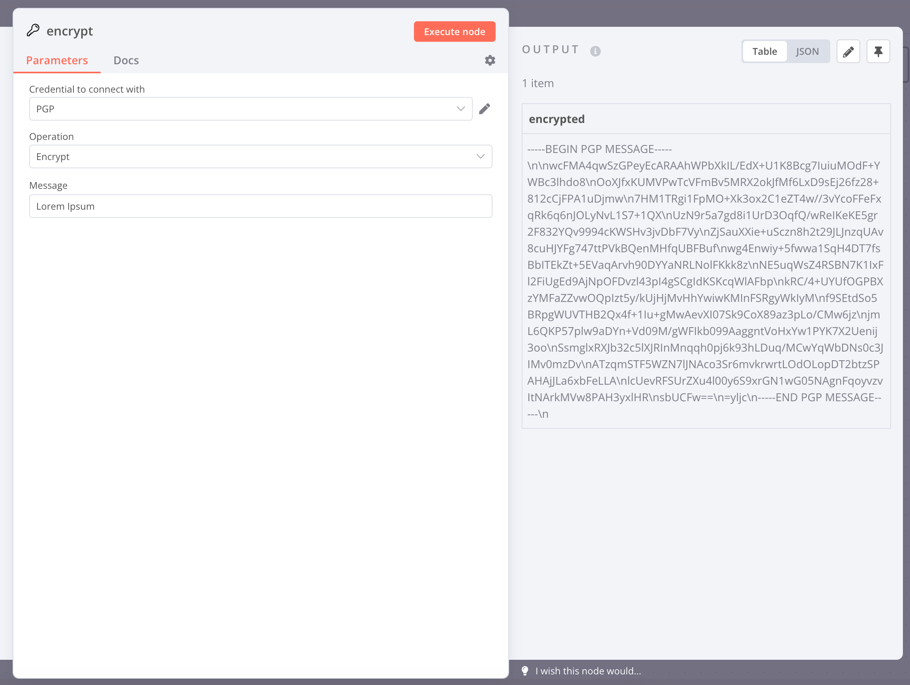
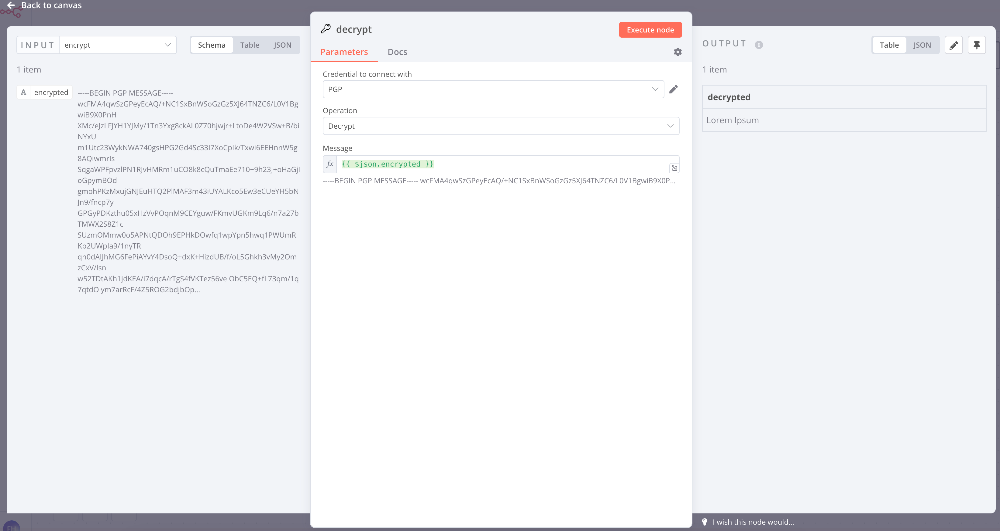
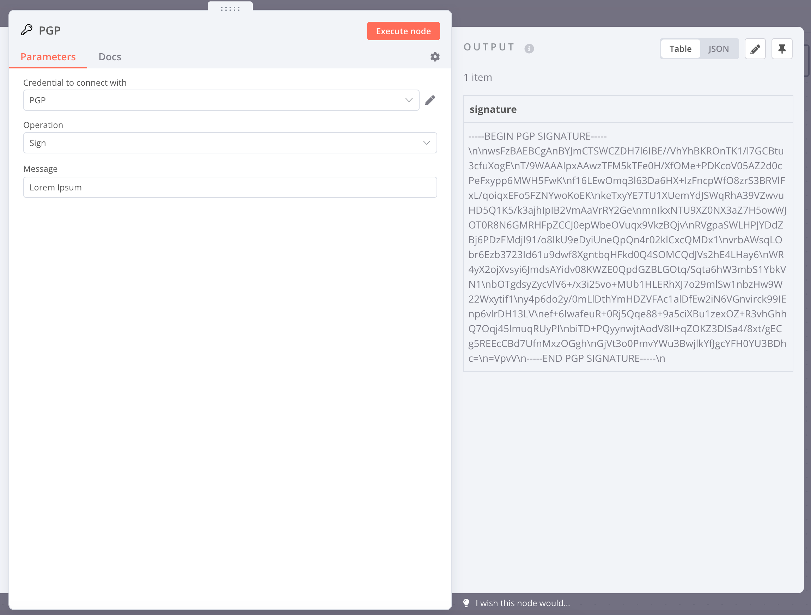

# n8n-nodes-pgp

This is an n8n community node. It lets you use OpenPGP encryption and signing in your n8n workflows.

[OpenPGP](https://www.openpgp.org/) is a standard for encryption and signing of data.

[n8n](https://n8n.io/) is a [fair-code licensed](https://docs.n8n.io/reference/license/) workflow automation platform.

## Table of Contents
* [Installation](#installation)
* [Operations](#operations)
* [Credentials](#credentials)
* [Resources](#resources)
* [Screenshots](#screenshots)


## Installation

Follow the [installation guide](https://docs.n8n.io/integrations/community-nodes/installation/) in the n8n community nodes documentation.

## Operations

- **Encrypt**: Encrypts text or binary files using a public key. Binary files can be compressed before encryption.
- **Decrypt**: Decrypts text or binary files using a private key. Compressed files are automatically decompressed after decryption.
- **Sign**: Creates a digital signature for text or binary files using a private key.
- **Verify**: Checks if a digital signature is valid for text or binary files using a public key.
- **Encrypt-And-Sign**: Encrypts and signs text or binary files in one step. Binary files can be compressed before encryption.
- **Decrypt-And-Verify**: Decrypts and verifies text or binary files in one step. Compressed files can be decompressed after decryption.


## Credentials

To authenticate with this node, you need to provide the following credentials:
- Passphrase: The passphrase for the private key.
- Public Key: Armored public key for encryption and verification.
- Private Key: Armored private key for decryption and signing.

## Resources

- [n8n community nodes documentation](https://docs.n8n.io/integrations/community-nodes/)
- [openpgpjs](https://openpgpjs.org/)

## Screenshots

### Credentials


### Encryption


### Decryption


### Signing


### Verification


## Test Results

This section displays the results of unit tests for each operation, based on a live n8n instance.

| Operation        | Last Tested                                           | Status                                                 |
|------------------|-------------------------------------------------------|--------------------------------------------------------|
| Encrypt (Text)   | <span id="test-encrypt-text-date">2025-02-16</span>   | <span id="test-encrypt-text-result">✅ Success</span>   |
| Decrypt (Text)   | <span id="test-decrypt-text-date">2025-02-16</span>   | <span id="test-decrypt-text-result">✅ Success</span>   |
| Sign (Text)      | <span id="test-sign-text-date">2025-02-16</span>      | <span id="test-sign-text-result">✅ Success</span>      |
| Verify (Text)    | <span id="test-verify-text-date">2025-02-16</span>    | <span id="test-verify-text-result">✅ Success</span>    |
| Encrypt (Binary) | <span id="test-encrypt-binary-date">2025-02-16</span> | <span id="test-encrypt-binary-result">✅ Success</span> |
| Decrypt (Binary) | <span id="test-decrypt-binary-date">2025-02-16</span> | <span id="test-decrypt-binary-result">✅ Success</span> |
| Sign (Binary)    | <span id="test-sign-binary-date">2025-02-16</span>    | <span id="test-sign-binary-result">✅ Success</span>    |
| Verify (Binary)  | <span id="test-verify-binary-date">2025-02-16</span>  | <span id="test-verify-binary-result">✅ Success</span>  |

### Unit Tests

Unit tests can be executed with the following command:

```bash
npx jest
```

#### Test Results

**binary-utils.test.ts**

* Convert text data to base64 string
* Convert base64 string back to text data
* Convert binary data to base64 string
* Convert base64 string back to binary data

**sign.test.ts**

* Signs and verifies text message
* Signs and verifies text message with encrypted private key
* Verify fails with a different keypair
* Signs binary data
* Verify fails with a different keypair

**data-compressor.ts**

* Compresses and decompresses with zlib
* Compresses and decompresses with zip
* Throws an error for unsupported algorithm during compression
* Throws an error for unsupported algorithm during decompression

**encrypt.test.ts**

* Encrypts and decrypts a text message
* Encrypts and decrypts a text message with encrypted private key
* Decryption fails with a different private key
* Encrypts and decrypts a binary file
* Binary decryption fails with a dirrent private key
* Encryps and decrypts a compresses binary file

#### Code Coverage:
* Statements: 100%
* Branches: 100%
* Functions: 100%
* Lines: 100%
