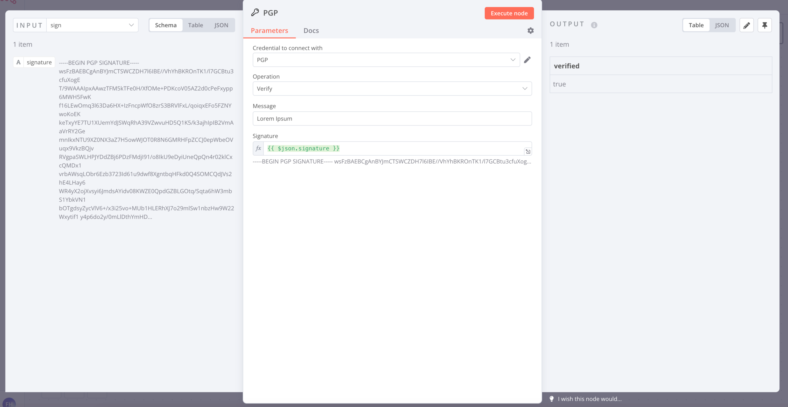

# n8n-nodes-pgp

This is an n8n community node. It lets you use OpenPGP encryption and signing in your n8n workflows.

[OpenPGP](https://www.openpgp.org/) is a standard for encryption and signing of data.

[n8n](https://n8n.io/) is a [fair-code licensed](https://docs.n8n.io/reference/license/) workflow automation platform.

## Table of Contents
* [Installation](#installation)
* [Operations](#operations)
* [Credentials](#credentials)
* [Resources](#resources)
* [Screenshots](#screenshots)

## Installation

Follow the [installation guide](https://docs.n8n.io/integrations/community-nodes/installation/) in the n8n community nodes documentation.

## Operations

- Encrypt: Encrypts text using OpenPGP encryption.
- Decrypt: Decrypts text using OpenPGP decryption.
- Sign: Signs text using OpenPGP signing.
- Verify: Verifies the signature of text using OpenPGP.
- Encrypt And Sign: Encrypts and signs the message using OpenPGP.
- Verify And Decrypt: Verifies and Decrypts the message using OpenPGP.

## Credentials

To authenticate with this node, you need to provide the following credentials:
- Passphrase: The passphrase for the private key.
- Public Key: Armored public key for encryption and verification.
- Private Key: Armored private key for decryption and signing.

## Resources

- [n8n community nodes documentation](https://docs.n8n.io/integrations/community-nodes/)
- [openpgpjs](https://openpgpjs.org/)

## Screenshots

### Credentials

### Encryption

### Decryption

### Signing

### Verification

### Encrypt and Sign

### Verify and Decrypt

## Test Results

This section displays the results of unit tests for each operation.

| Operation            | Last Tested                                               | Status                                                     |
|----------------------|-----------------------------------------------------------|------------------------------------------------------------|
| Encrypt              | 2024-11-16            | ✅ Success            |
| Decrypt              | 2024-11-16            | ✅ Success             |
| Sign                 | 2024-11-16               | ✅ Success                |
| Verify               | 2024-11-16             | ✅ Success              |
| Encrypt And Sign     | 2024-11-16   | ✅ Success    |
| Verify And Decrypt   | 2024-11-16 | ✅ Success |
